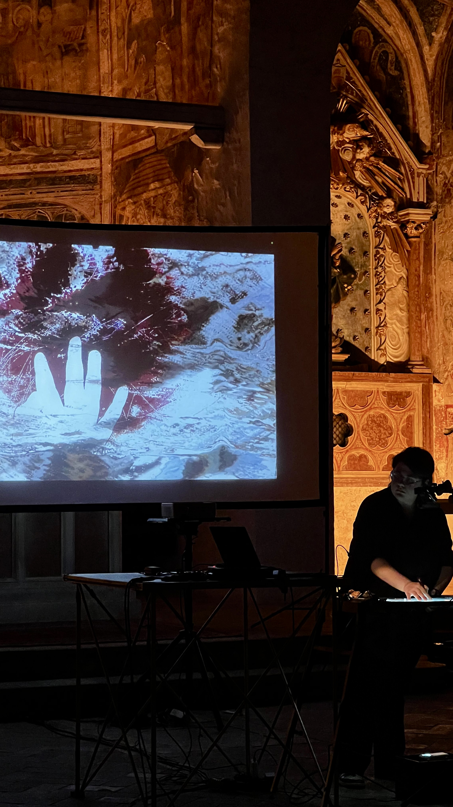
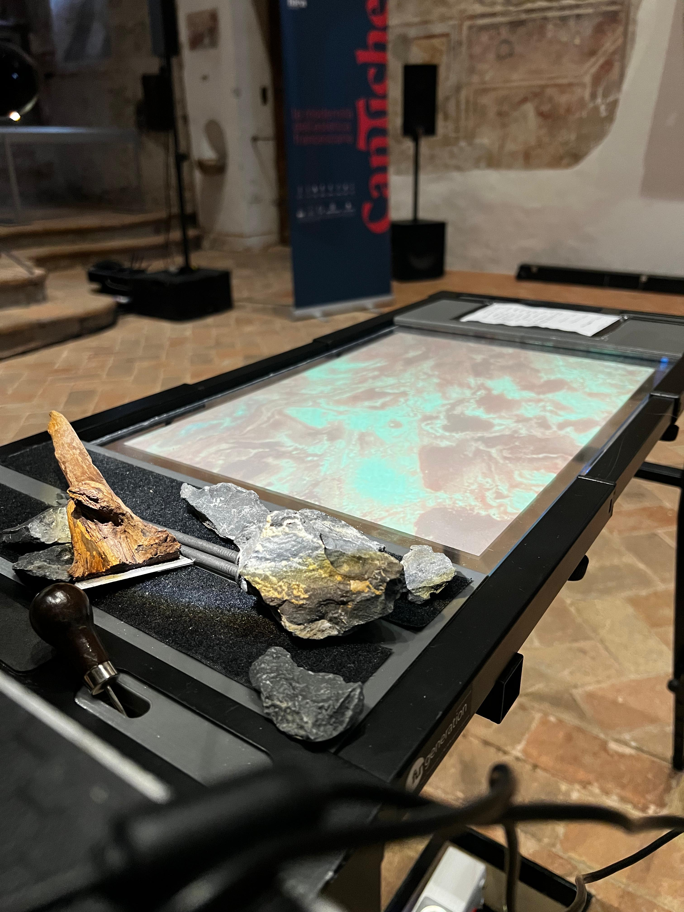
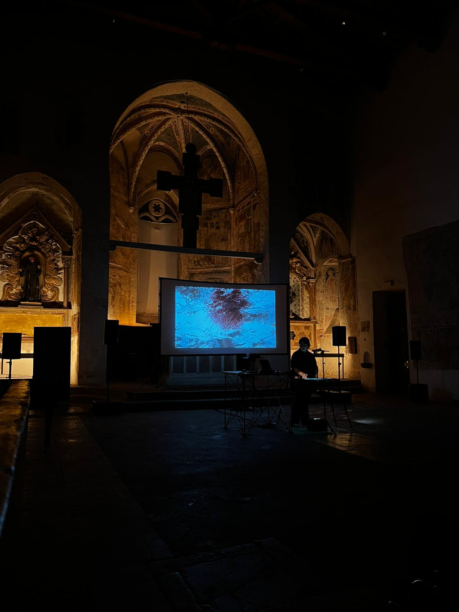

# Ambiente 1: Frammenti di una Lauda
## A Contemporary Reinterpretation of the "Laudes Creaturarum"

The work is configured as a contemporary reinterpretation of the **Laudes Creaturarum** (Canticle of the Creatures), in which the *Lauda* acts as a memory of the past within today’s complex society, symbolized by the human-machine dialogue.

The performer interacts with a dedicated physical medium, placing the **gesture** at the center of the work: leaving a trace of the musical gesture through the use of specific tools, assisted by Artificial Intelligence (AI). The AI deciphers the tools and signs, triggering the processing of sonic and visual elements.

In this dialogue, the original fragments of the *Lauda* are progressively rarefied and destroyed, accentuating their nature as a fading memory. The equilibrium breaks at the climax of the execution, when technology acquires complete control of the system and the executive environment becomes an **autonomous machine**. The initial tools become obsolete and the performer's action is interrupted. Only the signs engraved on the physical support remain for the artist. These fragments constitute the memory and the final trace of the interaction — the only remaining cognition of the *Lauda* in a contemporaneity now distant from the world that surrounds it.

---

###  Artistic Concept: The Rarefaction of Memory
The performance proposes a journey from the physical creation to its complete digital transformation:

* **Visual Evolution:** The project includes **10 digital paintings** associated with the different parts of the *Lauda*. During the performance, these visuals are initially processed and distorted; they are gradually revealed as the performer interacts with the surface.
* **The Gesture:** The performer "scratches" the media using a specific set of tools, making the continuous dialogue between the artwork, music, and machine visible.
* **Fragmentation:** The original fragments of the *Lauda* are progressively rarefied and destroyed, accentuating their nature as a fading memory.
* **Machine Autonomy:** The equilibrium breaks at the climax. Technology takes complete control, and the environment becomes an autonomous machine, leaving only the physical incisions as the final trace.
  
---

  
   
  
   
  
   
  

---

### Technical System Architecture
The system relies on a complex interaction between computer vision and real-time audio/video processing:

* **Live Electronics:** Fixed Media processed in real-time by the performer's gestures through multiple simultaneous processing layers.
* **Software Ecosystem:**
    * **Max/MSP:** Control interface and sign recognition system using the **entrymatcher** object (A. Harker library), communicating via **OSC** protocol.
    * **Python & Computer Vision:** Hands tracking system via **MediaPipe** (hand landmarks) and object identification through **YOLO**, transmitting data via **OSC**.
    * **OBS Studio:** Used for video routing and projection management. Visuals (the 10 paintings) are projected behind the performer, overlaying the interaction.
    * **Hardware & Tools:**  Plexiglass interface and a multi-camera tracking system.
    * **Specific Tools:** Awl (punteruolo), nail (chiodo), olive branch with blade (ramo di ulivo con lama), and stones (pietre).

---
###  Credits & Institutional Support
This work was created for **"Cantiche"**, a project supported by the **"Sostegno Spettacoli dal Vivo anno 2024"** Grant.
* **Funding:** PR FESR 2021-2027. Az 1.3.4. - Support for tourism, service, cinematic, audiovisual, cultural, creative, and social enterprises.
* **Venue:** San Francesco Museum Complex (Complesso Museale di San Francesco), Trevi, Perugia.

---

---

---

---

### Resources
<ul>
  <li><a href="https://www.youtube.com/watch?v=RnN5_pXjVl0&t=709s" target="_blank"><strong> Full Performance Video (YouTube)</strong></a></li>
  <li><a href="https://drive.google.com/drive/folders/1t140WlJAHLprfN9AcZnES3CXCDdcZhH8?usp=sharing" target="_blank"><strong>Info and Technical Rider (Google Drive)</strong></a></li>
  <li><strong>Code and Patches (Google Drive)</strong> (coming soon)</li>
</ul>

  <a href="https://youtu.be/RnN5_pXjVl0?si=mO9CST7v8hts_2Je" target="_blank">
    
     
    <em style="display: block; margin-top: 10px;">Full Performance Video</em>
  </a>

---

<a href="./index.html">← Back to Home</a>

