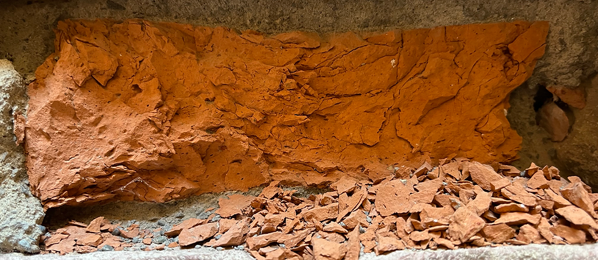
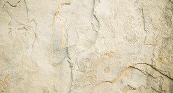
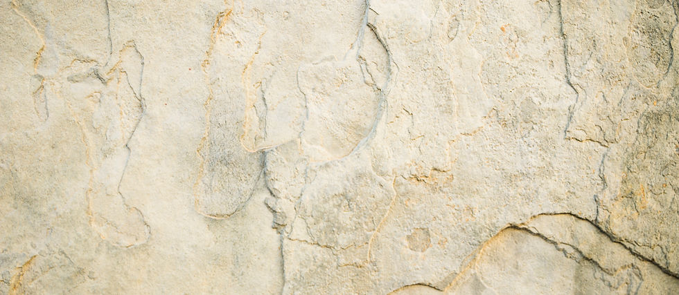
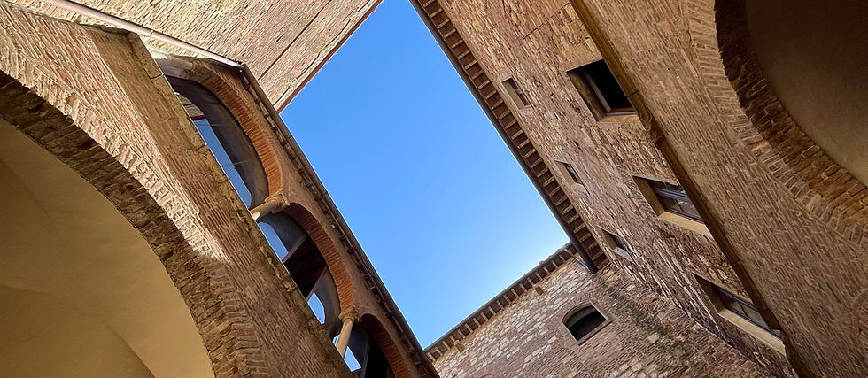

# Materia e Memoria
## Sound Installation: Electromagnetic Phenomena and Natural Materials

This project is a sound exploration that arises from the interaction between electromagnetic phenomena and natural materials. 

Through the encounter of micro-magnets, coils, and materials such as ferrite and limestone rocks, microsounds emerge—which are then manipulated and organized to create an artificial memory of the matter itself.

---

<table style="width:100%; border:none; border-collapse:separate; border-spacing: 10px; table-layout: fixed;">
  <tr>
    <td style="padding:0; border:none;">
      
    </td>
    <td style="padding:0; border:none;">
      
    </td>
  </tr>
  <tr>
    <td style="padding:0; border:none;">
      
    </td>
    <td style="padding:0; border:none;">
      
    </td>
  </tr>
</table>

---

###  Concept: The Reconstruction of Memory
The core of the installation is the reconstruction of the **memory of matter**. 

* **Objective Reality:** Matter is the objective reality that exists independently of human perception. In this work, it is represented by the sounds of rocky materials like **travertine**, a stone deeply rooted in the landscape of Montepulciano.
* **Dual Perception:** Matter is explored through two distinct lenses:
    1. **Pure State:** Perception devoid of memory and recollection, untouched by preexisting influences.
    2. **Influenced State:** Perception shaped by our experiences, our lives, and our personal memories.
* **The Dialectic:** The tension between pure perception and memory allows us to construct a personal recollection of the objective reality. This is achieved through the stratification and elaboration of sound materials, ultimately creating **artificial memories** of the matter rather than a pure perception of it.

---

###  Technical Implementation
* **Sound Sources:** Interaction between electromagnetic fields (micro-magnets and coils) and physical elements (ferrite, travertine, limestone).
* **Processing:** Stratification of sonic textures to represent the "memory layers" of the stones.
* **Site-Specific Elements:** Use of locally sourced travertine to anchor the installation to its geographical context.

---

### Credits & Institutional Support
* **Project:** Developed and exhibited in the context of research on sound and material memory.
* **Location Focus:** Inspired by the geological characteristics of **Montepulciano**, Italy.

---

[← Back to Home](./index.html)
